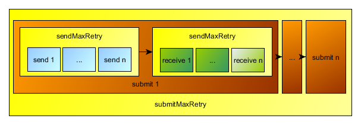

burst-miner
===========

## What is burst-miner

burst-miner is a client application for mining Burst on a pool. For more informations about Burst follow [this link](https://www.burst-team.us/).
It is written in C++ and therefore can be compiled on different operating systems.
It is designed multi-threaded to reach the best performance. While mining, only the CPU is used.

## Fork

This is a fork of the burst-miner found on [this github repository](https://github.com/uraymeiviar/burst-miner).
The purpose of this fork is to optimize and beautify the original program and on this way make it more user friendly.

## Build

| Platform | Master |
| -------- | ------ |
|   Linux   | [](https://travis-ci.org/Creepsky/burst-miner) |
|   Windows   | [](https://ci.appveyor.com/project/Creepsky75522/burst-miner/branch/master) |

## Donations :moneybag:

The orignal author is uray meiviar (uraymeiviar@gmail.com).

If you want to support him, you can donate to:

```
- [ Burst   ] BURST-8E8K-WQ2F-ZDZ5-FQWHX
- [ Bitcoin ] 1UrayjqRjSJjuouhJnkczy5AuMqJGRK4b
```

If you want to support me, you can donate to:

```
- [ Burst   ] BURST-JBKL-ZUAV-UXMB-2G795
```

## Config

You can use a custom config-file by explicit naming it on call: ```burst-miner.exe <config-file>```.
If you leave the config-file-parameter empty, the config-file with the name mining.conf in the execution-path will be used.

Inside the config-file, you can define the following settings:

```
{
    "poolUrl" : "burst-pool.cryptoport.io:8124",
    "submissionMaxRetry" : 3,
    "sendMaxRetry" : 3,
    "receiveMaxRetry" : 3,
    "receiveTimeout" : 5,
    "sendTimeout" : 5,
    "maxBufferSizeMB" : 128,
    "output" : [
        "debug",
        "+progress",
        "-nonce found"
    ],
    "plots" : [
        "/Users/uraymeiviar/plots",
        "/Users/uraymeiviar/Documents/plots"
    ]
}
```

|  setting  |  description  |
| --------- | ------------- |
| **poolUrl** | the host, to whom the miner will connect. |
| **miningInfoUrl** | the host, where the miner will get the mining info. If empty, its set to poolUrl. |
| **submissionMaxRetry** | the max tries to resend a message to the server. |
| **sendMaxRetry** | the max tries to send the nonce per submission-retry. |
| **receiveMaxRetry** | the max tries to receive the answer for a nonce from server per submission-retry. |
| **receiveTimeout** | the max time to wait for a response from the server. |
| **sendTimeout** | the max time to wait for sending a message to the server. |
| **maxBufferSizeMB** | the buffer size while reading the plot files. |
| **output** | decides, what messages will be printed in the output. For possible values see [Output-Flags](#output-flags).  |
| **plots** | the paths to the directories, where to search for plot files. plot files are searched every new block. |

## Output-Flags

Output-Flags can be set in the **output** block in the configuration file.
If a flag is given, it will be set in the miner application.

It is possible to explicit set flags with the prefix **+** (for example "+nonce found") or unset with the prefix **-** (for example "-nonce found").
If no prefix is set, the **+** prefix is set implicitly.

| flag | description |
| ---- | ----------- |
| progress | the progress in percent while reading the plot files |
| debug | debug messages |
| nonce found | shows every found nonce with the deadline |
| nonce found plot | (only in comination with **nonce found**) shows the plot file of found nonce |
| nonce confirmed plot | shows the plot file of confirmed nonces |
| plot done | shows done plot files while searching for nonces |
| dir done | shows done dirs while searching for nonces |

## Submit-Process

To have a better understanding for the settings in mining.conf, have a look at the submit-process.



A nonce is submitted max **submissionMaxRetry** times, before the submission gets aborted. In each submission first the nonce is send to the server max **sendMaxRetry** times, then for each sending a response received max **receiveMaxRetry** times.

If you have the settings

| option             | value |
| ------------------ | ---- |
| submissionMaxRetry | 3    |
| sendMaxRetry       | 3    |
| receiveMaxRetry    | 3    |

you get the following max retries:

| process     | retries |
| ----------- | ---- |
| submissions | 3 = submissionMaxRetry   |
| sendings    | 9 = sendMaxRetry * submissionMaxRetry |
| receivings  | 27 = sendings * receiveMaxRetry |

## Compiling

If you want to compile the project by yourself, please note the following informations.

**Dependencies**

There are no real dependencies, everything is included directly in the project.

**Linux**

In the root directory, you can call the following commands:

```
make (all): build the project, output dir is /bin
make clean: remove the compiled data in /bin
```

Alternativly you can build with CMake. Just use the CMakeLists in the root directory.

**Windows**

Use the Visual Studio project to compile the sources. Everything is set up already.
You find the configurations:

```
Release: release mode with SSE2 instruction set
Release_AVX: release mode with AVX instruction set
Release_AVX2: release mode with AVX2 instruction set
```

## Contribution

We are glad about every contribution to the project. Dont hesitate to open an issue, if you found a bugfix or have an idea for a new feature!

If you want to share your own code, please follow these steps:
- create a fork of this repository
- add a new branch for your changings
- add your changes to the code
- dont forget to mention the issue number in the commit messages (just write something like ```<message> #<id>```)
- open a pull request and try to describe what the change is for
- done :)

Here you can find a good tutorial about [Contributing](https://akrabat.com/the-beginners-guide-to-contributing-to-a-github-project/).
